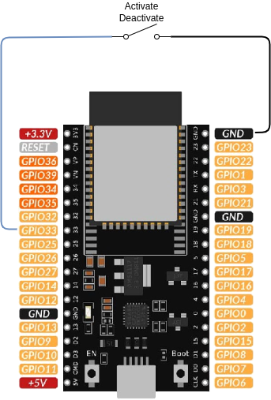

# Activation switch

This package adds a **physical two-position switch** to the solar router, wired to a GPIO of the ESP32. Its position drives solar routing activation without requiring any network, Home Assistant or web browser.

- switch closed → solar routing **enabled**,
- switch open → solar routing **disabled**.

If you also want a position forcing the router at 100 %, use [activate_switch_3positions](activate_switch_3positions.md) instead.

!!! warning "The physical switch always wins"
    The position of the physical switch is mirrored on the `activate` switch **continuously**, in both directions. As long as this package is included:

    - toggling *Activate Solar Routing* from Home Assistant or from the web server has no lasting effect: the state goes back to the position of the physical switch within one second,
    - a push button provided by [activate_button](activate_button.md) has no lasting effect either,
    - the `scheduler_forced_run.yaml` package **cannot work any more**: the routing it disables during the forced run window is immediately re-enabled.

    If you need the other sources to keep control between two operations of the switch, set `activate_switch_strict` to `"false"`. The position of the switch is then applied only when it is operated, and at boot.

## Prerequisites

This package is not standalone. It relies on a symbol provided by another package that must be included in your configuration:

- an `engine_*` package (e.g. `engine_1dimmer.yaml`) that provides the `activate` switch.

## Behaviour at boot

`activate` is restored from flash at start-up, which may not match the position of the physical switch (the router may for example have been powered off while the switch was moved). The package realigns `activate` on the physical switch within one second after boot, so the state you see always matches what you read on the front panel.

## Wiring

The switch is a simple dry contact between the GPIO and the ground. No external resistor is needed: the internal pull-up of the ESP32 is enabled by the package.



With this wiring, the contact is **closed** when routing must be enabled, which is the default polarity of the package (`activate_switch_inverted: "True"`). If your switch is wired the other way around (contact closed means routing disabled), set `activate_switch_inverted` to `"False"`.

!!! danger "Choose a usable GPIO"
    GPIO6 to GPIO11 are wired to the internal SPI flash of the ESP32 and cannot be used. GPIO34 to GPIO39 are input-only and have **no internal pull-up**, so they are not suitable either unless you add an external pull-up resistor. GPIO32 and GPIO33 are a safe choice.

## Feedback in Home Assistant

The package exposes an *Activate Switch Position* text sensor, in the diagnostic category, reporting the position actually read from the contact: `Disabled` or `Solar routing`. Set `hide_activate_switch_position` to `"True"` to hide it.

## Configuration

To use this package, add the following lines to your configuration file:

```yaml linenums="1"
packages:
  activate_switch:
    url: https://github.com/hacf-fr/Solar-Router-for-ESPHome/
    files:
      - path: solar_router/activate_switch.yaml
        vars:
          activate_switch_pin: GPIO32
```

### Variables

| Variable                        | Required | Default   | Description                                                                                                                                                       |
| ------------------------------- | -------- | --------- | ----------------------------------------------------------------------------------------------------------------------------------------------------------------- |
| `activate_switch_pin`           | yes      | —         | GPIO pin the switch is connected to. The internal pull-up is enabled.                                                                                             |
| `activate_switch_inverted`      | no       | `"True"`  | Set to `"False"` if a **closed** contact means routing disabled.                                                                                                  |
| `activate_switch_debounce`      | no       | `50ms`    | Debounce time of the mechanical contact.                                                                                                                          |
| `activate_switch_strict`        | no       | `"true"`  | Set to `"false"` so the position is only applied when the switch is operated, letting Home Assistant, a push button or the scheduler drive `activate` in between. |
| `hide_activate_switch`          | no       | `"True"`  | Set to `"False"` to expose the raw state of the contact in Home Assistant, which is handy to check your wiring.                                                   |
| `hide_activate_switch_position` | no       | `"False"` | Set to `"True"` to hide the *Activate Switch Position* text sensor.                                                                                               |
