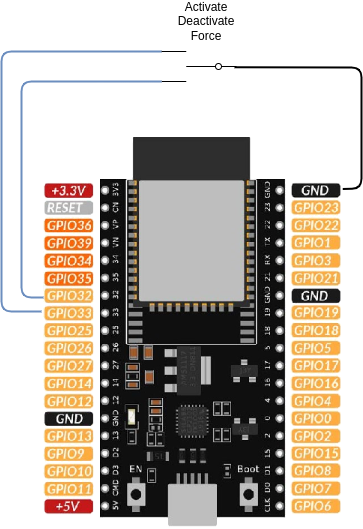

# 3-position activation switch

This package adds a **physical three-position switch** to the solar router, wired to two GPIO of the ESP32. Its position drives solar routing without requiring any network, Home Assistant or web browser.

| Lever position | Closed contact              | State of the router                        |
| -------------- | --------------------------- | ------------------------------------------ |
| up             | `activate_switch_off_pin`   | solar routing **disabled**, router level 0 |
| centre         | none                        | solar routing **enabled**                  |
| down           | `activate_switch_force_pin` | router **forced at 100 %**                 |

The first two positions behave exactly like [activate_switch](activate_switch.md). The third one forces the load at full power the same way `scheduler_forced_run.yaml` does: `activate` is switched off so the solar regulation stops adjusting, then `router_level` is set to 100 %.

!!! warning "The physical switch always wins"
    The position of the switch is enforced **continuously**. As long as this package is included:

    - toggling *Activate Solar Routing* or moving *Router Level* from Home Assistant has no lasting effect: the router goes back to the position of the switch within one second,
    - a push button provided by [activate_button](activate_button.md) has no lasting effect either,
    - the `scheduler_forced_run.yaml` package **cannot work any more**.

    If you need the other sources to keep control between two operations of the switch, set `activate_switch_strict` to `"false"`. The position is then applied only when the switch is operated, and at boot.

!!! note "The forced position honours the temperature limiter"
    When `activate` is off, the `energy_regulation` script no longer runs, and it is the only place where the `safety_limit` flag of a `temperature_limiter_*` package is normally checked. This package therefore re-checks it itself: while the safety limit is active, the forced position holds `router_level` at 0 and releases it back to 100 % once the temperature has dropped below the restart threshold.

    Note that `scheduler_forced_run.yaml` does **not** have this protection.

## Prerequisites

This package is not standalone. It relies on symbols provided by another package that must be included in your configuration:

- an `engine_*` package (e.g. `engine_1dimmer.yaml`) that provides the `activate` switch and the `router_level` number.

It is **exclusive** with [activate_switch](activate_switch.md): both declare the same identifiers, so include one or the other, never both.

## Behaviour at boot

`activate` is restored from flash at start-up, which may not match the position of the physical switch. The package enforces the position of the switch within one second after boot, so the state of the router always matches what you read on the front panel.

## Wiring

Use a standard ON-OFF-ON toggle switch (or a 3-position rotary switch with a common terminal). The common terminal goes to the ground, the two outer terminals to the GPIO. No external resistor is needed: the internal pull-ups of the ESP32 are enabled by the package.



With this wiring a contact is **closed** when the lever selects it, which is the default polarity of the package. If a contact is wired the other way around, set `activate_switch_off_inverted` or `activate_switch_force_inverted` to `"False"`.

If both contacts happen to be closed at the same time (a wiring mistake, or a switch that shorts both terminals while passing through the centre), the forced position wins.

!!! danger "Choose usable GPIO"
    GPIO6 to GPIO11 are wired to the internal SPI flash of the ESP32 and cannot be used. GPIO34 to GPIO39 are input-only and have **no internal pull-up**, so they are not suitable either unless you add external pull-up resistors. GPIO32 and GPIO33 are a safe choice.

## Feedback in Home Assistant

The package exposes an *Activate Switch Position* text sensor, in the diagnostic category, reporting the position actually read from the contacts: `Disabled`, `Solar routing` or `Forced 100%`. Set `hide_activate_switch_position` to `"True"` to hide it.

The two raw contacts are exposed as *Activate Switch Off Contact* and *Activate Switch Force Contact*; they are internal by default and can be shown with `hide_activate_switch: "False"` to check your wiring.

## Configuration

To use this package, add the following lines to your configuration file:

```yaml linenums="1"
packages:
  activate_switch_3positions:
    url: https://github.com/hacf-fr/Solar-Router-for-ESPHome/
    files:
      - path: solar_router/activate_switch_3positions.yaml
        vars:
          activate_switch_off_pin: GPIO32
          activate_switch_force_pin: GPIO33
```

### Variables

| Variable                         | Required | Default   | Description                                                                                                                                        |
| -------------------------------- | -------- | --------- | -------------------------------------------------------------------------------------------------------------------------------------------------- |
| `activate_switch_off_pin`        | yes      | —         | GPIO pin closed by the "routing disabled" position. The internal pull-up is enabled.                                                               |
| `activate_switch_force_pin`      | yes      | —         | GPIO pin closed by the "forced run" position. The internal pull-up is enabled.                                                                     |
| `activate_switch_off_inverted`   | no       | `"True"`  | Set to `"False"` if the "routing disabled" contact is **open** when the lever selects it.                                                          |
| `activate_switch_force_inverted` | no       | `"True"`  | Set to `"False"` if the "forced run" contact is **open** when the lever selects it.                                                                |
| `activate_switch_debounce`       | no       | `50ms`    | Debounce time of the mechanical contacts.                                                                                                          |
| `activate_switch_forced_level`   | no       | `"100"`   | Router level, in percent, applied in the forced position.                                                                                          |
| `activate_switch_strict`         | no       | `"true"`  | Set to `"false"` so the position is only applied when the switch is operated, letting Home Assistant or the scheduler drive the router in between. |
| `hide_activate_switch`           | no       | `"True"`  | Set to `"False"` to expose the raw state of the two contacts in Home Assistant, which is handy to check your wiring.                               |
| `hide_activate_switch_position`  | no       | `"False"` | Set to `"True"` to hide the *Activate Switch Position* text sensor.                                                                                |
