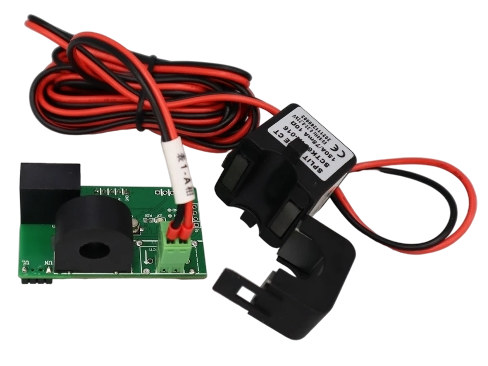

# JSY-MK-194T Energy Counter

## Description

The **JSY-MK-194T Energy Counter** measures the actual energy diverted to the load using the **current readings from the JSY-MK-194T dual-channel power meter**. Unlike the theoretical counter, this module uses real hardware measurements rather than calculations based on a declared load power, giving a more accurate account of the energy effectively consumed.

This package shares the UART communication layer with the [JSY-MK-194T power meter](power_meter_jsy-mk-194t.md) via the `jsy-mk-194t_common.yaml` package. Both packages must be included together in your configuration.



## Common Configuration

!!! note "Shared configuration"
    `solar_router/jsy-mk-194t_common.yaml` configures UART communication and is used by both the power meter and the energy counter.

This file manages communication with the board. If you wish, you can expose
JSY-MK-194T measurements in Home Assistant; see the example below.

```yaml
packages:
  solar_router:
    url: https://github.com/hacf-fr/Solar-Router-for-ESPHome/
    refresh: 1s
    files: 
      # JSY-MK-194T management
      - path: solar_router/jsy-mk-194t_common.yaml
        vars:          
          uart_tx_pin: GPIO26
          uart_rx_pin: GPIO27
          uart_baud_rate: 4800
          AP_Ch2_internal: "false" # optional, allows displaying one of the JSY-MK-194T sensors
```

### JSY-MK-194T Sensor Options

Voltage on Channel 2 is not implemented; the meter uses the Channel 1 voltage.

| Variable | Required | Default | Description |
| --- | --- | --- | --- |
| `U_Ch1_internal` | no | `"true"` | Hide Channel 1 voltage in Home Assistant when `"true"` |
| `I_Ch1_internal` | no | `"true"` | Hide Channel 1 current in Home Assistant when `"true"` |
| `AP_Ch1_internal` | no | `"true"` | Hide Channel 1 active power in Home Assistant when `"true"` |
| `PAE_Ch1_internal` | no | `"true"` | Hide Channel 1 positive active energy in Home Assistant when `"true"` |
| `PF_Ch1_internal` | no | `"true"` | Hide Channel 1 power factor in Home Assistant when `"true"` |
| `NAE_Ch1_internal` | no | `"true"` | Hide Channel 1 negative active energy in Home Assistant when `"true"` |
| `PD_Ch1_internal` | no | `"true"` | Hide Channel 1 power direction in Home Assistant when `"true"` |
| `PD_Ch2_internal` | no | `"true"` | Hide Channel 2 power direction in Home Assistant when `"true"` |
| `frequency_internal` | no | `"true"` | Hide frequency in Home Assistant when `"true"` |
| `I_Ch2_internal` | no | `"true"` | Hide Channel 2 current in Home Assistant when `"true"` |
| `AP_Ch2_internal` | no | `"true"` | Hide Channel 2 active power in Home Assistant when `"true"` |
| `PAE_Ch2_internal` | no | `"true"` | Hide Channel 2 positive active energy in Home Assistant when `"true"` |
| `PF_Ch2_internal` | no | `"true"` | Hide Channel 2 power factor in Home Assistant when `"true"` |
| `NAE_Ch2_internal` | no | `"true"` | Hide Channel 2 negative active energy in Home Assistant when `"true"` |

## Energy Counter Configuration

To enable the energy counter, simply add it to your configuration as shown
in the example below:

```yaml
packages:
  solar_router:
    url: https://github.com/hacf-fr/Solar-Router-for-ESPHome/
    refresh: 1s
    files: 
      - path: solar_router/energy_counter_jsy-mk-194t.yaml
```

For a complete implementation example, refer to the
[JSY-MK-194T example](jsy-mk-194t.md).

### Variables

| Variable | Required | Default | Description |
| --- | --- | --- | --- |
| — | — | — | This module has no configuration variables. It uses the JSY-MK-194T measurements configured via `jsy-mk-194t_common.yaml`. |
