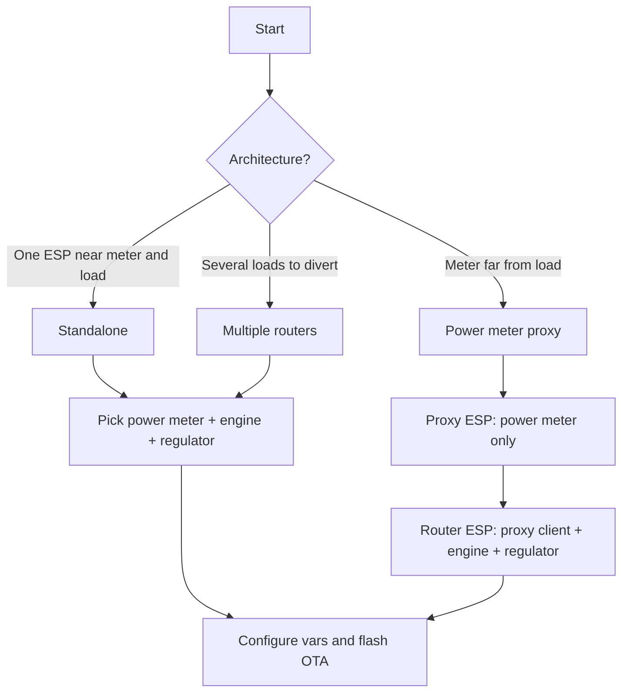

# Installation and Configuration

## Quick Start

1. Choose your [architecture](firmware.md#choosing-an-architecture) (standalone, proxy, or multiple routers).
2. Flash an empty ESPHome device and adopt it in Home Assistant (Step 1).
3. Add the required packages: **power meter** + **engine** + **regulator** (a proxy needs only a power meter).
4. Fill in each package `vars` from the package documentation (Step 3).
5. Upload the firmware via OTA from Home Assistant (Step 4).

For a ready-made YAML, start from the [standalone example](example_standalone.md) or the [proxy example](example_proxy.md). If something does not work after flashing, see [Troubleshooting](troubleshooting.md).

## Step 1: Install and configure ESPHome firmware

Install [ESPHome](https://esphome.io) on your ESP as described in the [Ready-Made Project](https://esphome.io/projects/) documentation.  
Select **"Empty ESPHome device"**.

Adopt it into [Home Assistant](https://home-assistant.io).

!!! important "WiFi reconnection"
    Remove `ap:` and `captive_portal:`.  
    *These can prevent the solar router from reconnecting to WiFi after a connection loss.*

## Step 2: Select packages

A **solar router** needs at least three packages: a **power meter**, a **regulator**, and an **engine**.

A **proxy** needs only one **power meter** package (activated at startup).

### Step 2.1: Select a Power Meter

| Power meter | Description |
| --- | --- |
| [Fronius](power_meter_fronius.md) | Power data from a Fronius inverter (tested on Gen24 Primo) |
| [Home Assistant](power_meter_home_assistant.md) | Power data from a Home Assistant sensor |
| [Shelly EM](power_meter_shelly_em.md) | Power data from a Shelly EM |
| [Shelly EM3 Pro / Pro 3EM](power_meter_shelly_em3.md) | Three-phase power data from a Shelly EM3 Pro / Pro 3EM |
| [JSY-MK-194T](power_meter_jsy-mk-194t.md) | Local UART meter (no network required) |
| [Proxy client](power_meter_proxy_client.md) | Power data from another ESPHome device over the network |

!!! abstract "Contribute"
    If you are a developer and your power meter is missing from this list, see [contributing](contributing.md).

### Step 2.2: Select a Regulator

| Type | Regulator | Description |
| --- | --- | --- |
| Progressive (0–100 %) | [Triac](regulator_triac.md) | Phase-control AC dimmer |
| Progressive (0–100 %) | [Solid State Relay](regulator_solid_state_relay.md) | Burst-fire regulation |
| ON/OFF | [Mechanical relay](regulator_mechanical_relay.md) | Simple relay switching |

!!! abstract "Contribute"
    If you are a developer and your regulator is missing from this list, see [contributing](contributing.md).

### Step 2.3: Add an Engine

| Engine | Description |
| --- | --- |
| [1 × dimmer](engine_1dimmer.md) | Progressive regulation for a single load |
| [1 × switch](engine_1switch.md) | ON/OFF regulation with start/stop thresholds |
| [1 × dimmer + bypass](engine_1dimmer_1bypass.md) | Progressive regulation with bypass relay at 100 % |
| [1 × dimmer + 2 × switches](engine_1dimmer_2switches.md) | Three-channel sequential distribution |
| [1 × dimmer + 2 × switches + bypass](engine_1dimmer_2switches_1bypass.md) | Three channels with bypass on the third |

See the [engines overview](engine.md) for LED behaviour and common options.

### Step 2.4: Add an Energy Counter (*optional*)

| Energy counter | Description |
| --- | --- |
| [Theoretical](energy_counter_theorical.md) | Estimates diverted energy from router level and load power |
| [JSY-MK-194T](energy_counter_jsy-mk-194t.md) | Measures diverted energy from the JSY-MK-194T |

### Step 2.5: Add a Temperature Limiter (*optional*)

| Temperature limiter | Description |
| --- | --- |
| [Home Assistant](temperature_limiter_home_assistant.md) | Safety limit from an HA temperature sensor |
| [DS18B20](temperature_limiter_DS18B20.md) | Safety limit from a local DS18B20 sensor |
| [Fan controller](temperature_fan_control.md) | Fan cooling based on temperature |

See the [temperature limiter overview](temperature_limiter.md).

### Step 2.6: Add a Scheduler (*optional*)

| Scheduler | Description |
| --- | --- |
| [Forced run](scheduler_forced_run.md) | Force or inhibit routing during a time window |

## Step 3: Configure your solar router

Each package is configured in the `vars` section of `packages`.  
Refer to the documentation of the selected packages and add the configuration to your YAML file.

You can refer to examples for a [standalone](example_standalone.md) installation, a [proxy-based](example_proxy.md) installation, or a [JSY-MK-194T](jsy-mk-194t.md) setup.

!!! example "More examples are available on [GitHub](https://github.com/hacf-fr/Solar-Router-for-ESPHome)"

## Step 4: Upload firmware

Install Solar Router on your ESP using OTA from Home Assistant.
