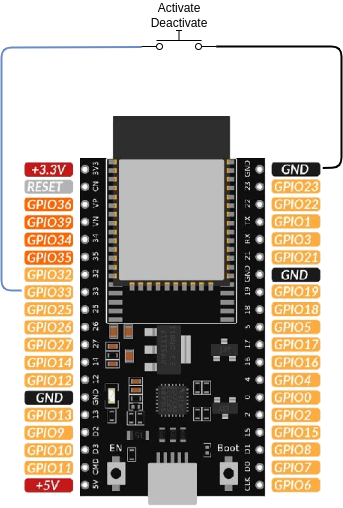

# Bouton poussoir d'activation

Ce package ajoute au routeur solaire un **bouton poussoir physique**, câblé sur une broche GPIO de l'ESP32. Chaque appui bascule l'activation du routage solaire, sans avoir besoin de réseau, de Home Assistant ni d'un navigateur.

Le bouton est un raccourci vers l'interrupteur *Activate Solar Routing* : il ne porte aucun état, il inverse simplement celui de l'interrupteur `activate`.

## Prérequis

Ce package n'est pas autonome. Il repose sur un identifiant fourni par un autre package qui doit être inclus dans votre configuration :

- un package `engine_*` (par exemple `engine_1dimmer.yaml`) qui fournit l'interrupteur `activate`.

!!! warning "À ne pas combiner avec un interrupteur d'activation"
    Si [activate_switch](activate_switch.md) ou [activate_switch_3positions](activate_switch_3positions.md) est également inclus avec son comportement strict par défaut, l'interrupteur physique applique en permanence sa propre position et le bouton n'a plus d'effet durable. Utilisez l'un **ou** l'autre, ou positionnez `activate_switch_strict` à `"false"` pour que les deux puissent piloter le routeur.

## Comportement au démarrage

Le bouton ne change rien au démarrage : `activate` conserve l'état restauré depuis la mémoire flash par le moteur (`restore_mode: RESTORE_DEFAULT_OFF`). Si vous souhaitez que l'état du routeur soit lisible sans ambiguïté en façade après une coupure de courant, utilisez plutôt [activate_switch](activate_switch.md).

## Câblage

Le bouton est un simple contact sec normalement ouvert entre la broche GPIO et la masse. Aucune résistance externe n'est nécessaire : la résistance de tirage interne de l'ESP32 est activée par le package.



Avec ce câblage, le contact est **fermé** tant que le bouton est appuyé, ce qui correspond à la polarité par défaut du package (`activate_button_inverted: "True"`). Si vous utilisez un bouton normalement fermé, positionnez `activate_button_inverted` à `"False"`.

!!! danger "Choisissez une broche GPIO utilisable"
    Les broches GPIO6 à GPIO11 sont reliées à la mémoire flash SPI interne de l'ESP32 et ne peuvent pas être utilisées. Les broches GPIO34 à GPIO39 sont en entrée seule et ne disposent **pas** de résistance de tirage interne : elles ne conviennent donc pas non plus, sauf à ajouter une résistance de tirage externe. GPIO32 et GPIO33 sont des choix sûrs.

## Configuration

Pour utiliser ce package, ajoutez les lignes suivantes à votre fichier de configuration :

```yaml linenums="1"
packages:
  activate_button:
    url: https://github.com/hacf-fr/Solar-Router-for-ESPHome/
    files:
      - path: solar_router/activate_button.yaml
        vars:
          activate_button_pin: GPIO33
```

### Variables

| Variable                   | Obligatoire | Défaut   | Description                                                                                                                    |
| -------------------------- | ----------- | -------- | ------------------------------------------------------------------------------------------------------------------------------ |
| `activate_button_pin`      | oui         | —        | Broche GPIO sur laquelle le bouton est raccordé. La résistance de tirage interne est activée.                                  |
| `activate_button_inverted` | non         | `"True"` | À mettre à `"False"` si le contact est **ouvert** lorsque le bouton est appuyé (bouton normalement fermé).                     |
| `activate_button_debounce` | non         | `50ms`   | Temps d'anti-rebond du contact mécanique. À augmenter si un seul appui bascule le routeur plusieurs fois.                      |
| `hide_activate_button`     | non         | `"True"` | À mettre à `"False"` pour exposer l'état brut du contact dans Home Assistant, ce qui est pratique pour vérifier votre câblage. |
