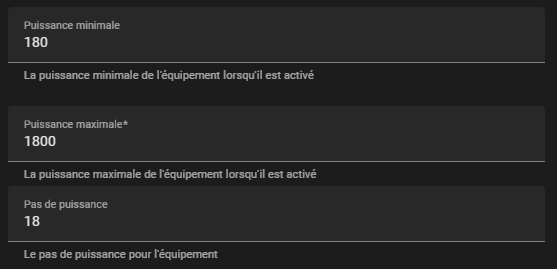
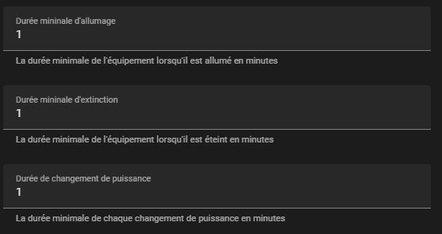
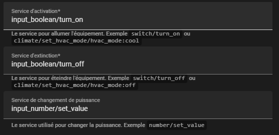
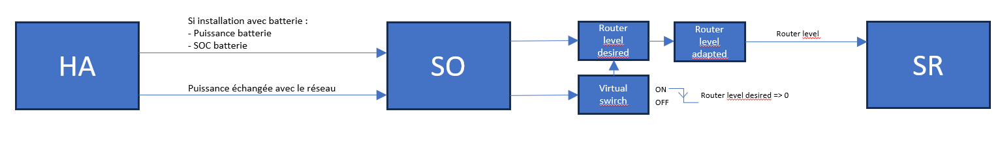
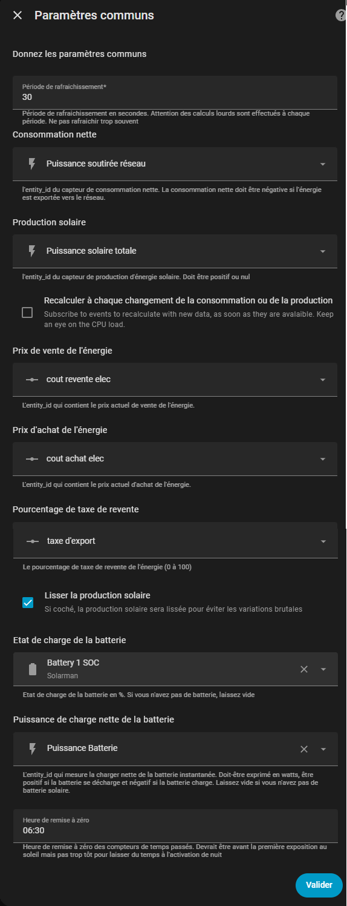

# Hybridation du Solar Router de Xavier Berger

## 1 – Objectif : Mettre en place une gestion hybride du Solar Router

Par conception, le routeur solaire permet de piloter une charge afin de converger vers une **injection réseau nulle** en modulant dynamiquement sa puissance.

Dans une installation avec batterie ou avec d’autres consommateurs prioritaires, il n’y a pas de gestion de priorité native : le routeur solaire est toujours le dernier servi et ne consomme que le surplus énergétique disponible.

Dans le cas d’un chauffe-eau sanitaire (**ECS**), lors de journées peu ensoleillées, l’énergie routée peut être insuffisante pour garantir une température d’eau correcte. Il devient alors nécessaire de compléter la chauffe en heures creuses (HC) la nuit.

Dans une installation avec batterie, cette logique est contre-productive :

* Double conversion énergétique (PV → Batterie → Réseau)
* Pertes supplémentaires
* Dégradation du rendement global

L’objectif est donc de pouvoir :

* Exploiter le routeur en **mode manuel** via home assistant lorsqu'on veut prioriser le routeur sur la charge batterie
* Basculer en **mode automatique** lorsque la batterie est suffisament chargée et qu'on veut augmenter la réactiviter du routage

La solution présentée repose sur l’intégration  [**Solar Optimizer (SO)**](https://github.com/jmcollin78/solar_optimizer) développée par [Jean-Marc COLLIN](https://github.com/jmcollin78)

---

## 2 – Présentation de Solar Optimizer (SO)

Solar Optimizer est une intégration Home Assistant qui agit comme le « chef d'orchestre »du pilotage des différents appareils qu'il
gère.

Contrairement à un routeur classique, son objectif n’est pas d’atteindre l’injection zéro, mais de déterminer la **stratégie énergétique la plus économique**.

À chaque itération (intervalle configurable), **SO** calcule la meilleure solution en fonction des paramètres suivants :

* Puissance échangée avec le réseau
* Coût d’achat de l’électricité
* Prix de revente
* Puissance batterie (si présente)
* État de charge batterie (si présente)

**SO** peut gérer plusieurs équipements simultanément.

---

## 3 – Pré-requis pour intégrer le Solar Router dans SO

### Gestion ON / OFF

Le Solar Router ne possède pas de switch ON/OFF natif (uniquement AUTO/MANUAL).

Or **SO** nécessite une entité ON/OFF.

Il faut donc créer un **template switch basé sur un `input_boolean`**.

---

### Gestion de la puissance

Deux possibilités :

1. Piloter directement `router_level`
2. Utiliser un **proxy de type number** (recommandé)

La seconde méthode permet d’appliquer une table de correction pour compenser la non-linéarité réelle de la charge.

---

## 4 – Configuration du Solar Router dans SO

### Pas de puissance

Exemple pour un chauffe-eau 1800W
(résolution 1%, minimum 10%)



---

### Paramètres temporels

Pour un équipement résistif tolérant les commutations fréquentes, et afin d’obtenir une forte réactivité :



---

### Services d’action

À configurer :

* Service ON
* Service OFF
* Service changement de puissance



---

### Facteur de division

Permet à **SO** de convertir la puissance réelle (0–1800W) vers un niveau de routage (0–100%).


---

### Paramètres optionnels

* Temps minimum / maximum journalier
* Heures creuses

Dans mon cas, ces paramètres ne sont pas utilisés.
La décision de forçage nocturne repose sur l’énergie stockée en fin de journée via une automatisation dédiée.

---

## 5 – Template Switch ON/OFF (`input_boolean`)

Comme le Solar Router ne gère pas ON/OFF directement :

* Passage à OFF → forcer `router_level` à 0
* Passage à ON → aucune action (**SO** gère la puissance)

### Exemple d’automatisation

```yaml
alias: Gestion mise OFF cumulus
description: ""

triggers:
  - trigger: state
    entity_id:
      - input_boolean.on_off_cumulus
    from:
      - "on"

conditions: []

actions:
  - action: input_number.set_value
    target:
      entity_id: input_number.router_level_desired
    data:
      value: 0

mode: single
metadata: {}
```

---

## 6 – Proxy de réglage du point de fonctionnement

### Architecture

```
input_number.router_level_desired
        ↓
number.router_level_adapted
        ↓
number.solarrouter_router_level
```

**SO** écrit une valeur entière entre 0 et 100 dans :

```
input_number.router_level_desired
```

Cette valeur représente le pourcentage théorique souhaité.

`number.router_level_adapted` applique une correction par interpolation.

---

### Template de correction

```yaml








  

  






  

  


{{ adapted_value | round(1) }}
```

---

Explications :

* Mise à jour à chaque modification de `router_level_desired`
* La table `point` sert de correspondance pour faire correspondre le % demandé à la bonne valeur de réglage du routeur pour tomber le plus proche possible du point de fonctionnement théorique équivalent.\ Elle peut être obtenu facilement en mesurant la puissance de la charge à différent % de consigne de **router_level**.\
* L'algorithme réalise simplement une interpolation linéaire et trouve la valeur idéale.
* Reste maintenant à mettre à jour le **router_level** de **SR**.

---

### Automatisation de mise à jour de **routeur_level** avec la valeur calculée

```yaml
alias: Mise à jour router + gestion ON/OFF
description: ""

triggers:
  - trigger: state
    entity_id:
      - number.router_level_adapted

conditions: []

actions:
  - action: number.set_value
    data:
      value: "{{ states('number.router_level_adapted') | float(0) }}"
    target:
      entity_id: number.solarrouter_router_level

  - if:
      - condition: numeric_state
        entity_id: number.router_level_adapted
        above: 0
    then:
      - action: input_boolean.turn_on
        target:
          entity_id: input_boolean.on_off_cumulus
    else:
      - action: input_boolean.turn_off
        target:
          entity_id: input_boolean.on_off_cumulus

mode: single
```
Explications : à chaque changement de **router_level_adapted** :

- On met à jour **router\_ level** avec la valeur de
  **router_level_adapted**

- Si **router_level_adapted** = 0

  - OFF template switch

- Si **router_level_adapted** \> 0

  - ON template switch

Récapitulatif visuel des informations principales :


---

## 7 – Gestion hybride (AUTO / MANUEL)

Une automatisation pilote :

* Le mode AUTO/MANUEL du Solar Router
* L’activation de la gestion **SO**

en fonction du SOC batterie.

### Logique utilisée

* Batterie > 79% → Mode AUTO (gestion surplus directe)
* Batterie < 80% → Mode MANUEL avec gestion par **SO**

---

### Automatisation

```yaml
alias: Bascule mode solar router selon seuil batterie
description: ""

triggers:
  - trigger: numeric_state
    entity_id:
      - sensor.solarman_battery
    above: 79
  - trigger: numeric_state
    entity_id:
      - sensor.solarman_battery
    below: 80

conditions: []

actions:
  - if:
      - condition: numeric_state
        entity_id: sensor.solarman_battery
        above: 79
    then:
      - action: switch.turn_off
        target:
          entity_id: switch.enable_solar_optimizer_cumulus
      - action: switch.turn_on
        target:
          entity_id: switch.solarrouter_activate_solar_routing
      - action: input_boolean.turn_off
        target:
          entity_id: input_boolean.on_off_cumulus
    else:
      - action: switch.turn_off
        target:
          entity_id: switch.solarrouter_activate_solar_routing
      - action: switch.turn_on
        target:
          entity_id: switch.enable_solar_optimizer_cumulus

mode: single
```

---

## 8 – Conclusion

Cette implémentation représente ma vision d’une gestion hybride efficace.

Elle nécessite potentiellement des ajustements selon :

* Le type d’installation
* Le profil batterie
* La stratégie énergétique recherchée

Dans mon cas, elle répond parfaitement à l’objectif initial :

**Prioriser l’usage du chauffe-eau par rapport à la charge batterie lorsque nécessaire.**

---

## 9 – Annexes

Réglages généraux **SO** + configuration chauffe-eau :




---

## 10 – Crédit

[@M3c4tr0x](https://github.com/M3c4tr0x)
