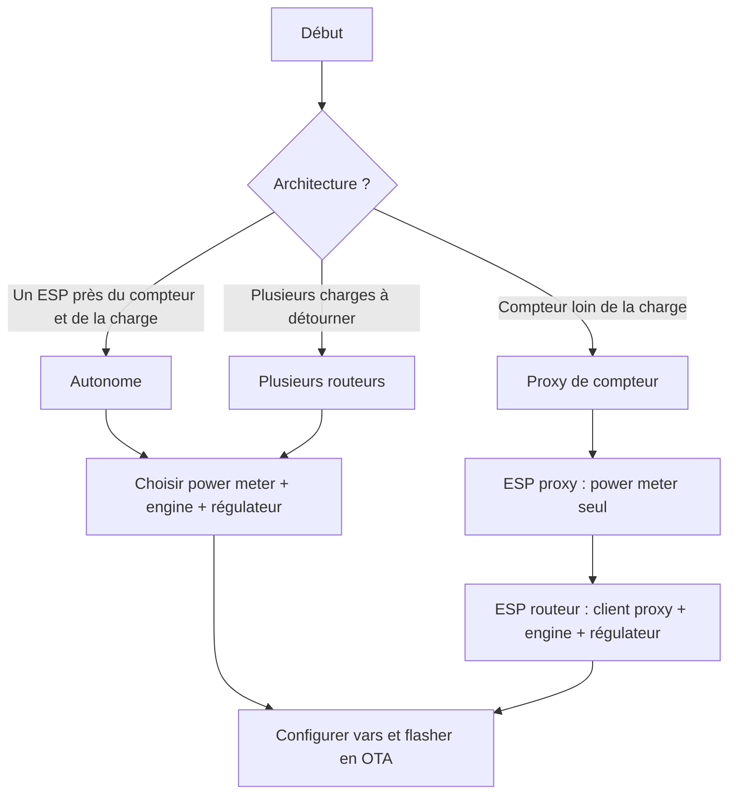

# Installation et Configuration

## Démarrage rapide

1. Choisissez votre [architecture](firmware.md#choisir-une-architecture) (autonome, proxy ou plusieurs routeurs).
2. Flashez un appareil ESPHome vide et adoptez-le dans Home Assistant (étape 1).
3. Ajoutez les packages requis : **power meter** + **engine** + **régulateur** (un proxy n'a besoin que d'un power meter).
4. Renseignez les `vars` de chaque package d'après sa documentation (étape 3).
5. Téléversez le firmware via OTA depuis Home Assistant (étape 4).

Pour un YAML prêt à l'emploi, partez de l'[exemple autonome](example_standalone.md) ou de l'[exemple proxy](example_proxy.md). Voir [Intégration Home Assistant](home_assistant.md) pour les entités et tableaux de bord. Si quelque chose ne fonctionne pas après le flash, voir [Dépannage](troubleshooting.md).

## Étape 1 : Installer et configurer le firmware ESPHome

Installez [ESPHome](https://esphome.io) sur votre ESP comme décrit dans la documentation [Ready-Made Project](https://esphome.io/projects/).  
Sélectionnez **"Empty ESPHome device"**.

Adoptez-le dans [Home Assistant](https://home-assistant.io).

!!! important "Reconnexion WiFi"
    Supprimez `ap:` et `captive_portal:`.  
    *Ces options peuvent empêcher le routeur solaire de se reconnecter au WiFi après une perte de connexion.*

## Étape 2 : Sélectionner les packages

Un **routeur solaire** nécessite au minimum trois packages : un **power meter**, un **régulateur** et un **engine**.

Un **proxy** n'a besoin que d'un package **power meter** (activé au démarrage).

### Étape 2.1 : Sélectionner un power meter

| Compteur de puissance | Description |
| --- | --- |
| [Fronius](power_meter_fronius.md) | Données de puissance depuis un onduleur Fronius (testé sur Gen24 Primo) |
| [Home Assistant](power_meter_home_assistant.md) | Données de puissance depuis un capteur Home Assistant |
| [Shelly EM](power_meter_shelly_em.md) | Données de puissance depuis un Shelly EM |
| [Shelly EM3 Pro / Pro 3EM](power_meter_shelly_em3.md) | Données triphasées depuis un Shelly EM3 Pro / Pro 3EM |
| [JSY-MK-194T](power_meter_jsy-mk-194t.md) | Compteur local via UART (sans réseau) |
| [Client Proxy](power_meter_proxy_client.md) | Données de puissance depuis un autre appareil ESPHome via le réseau |

!!! abstract "Contribuer"
    Si vous êtes développeur et que votre power meter manque dans cette liste, voir [contribuer](contributing.md).

### Étape 2.2 : Sélectionner un régulateur

| Type | Régulateur | Description |
| --- | --- | --- |
| Progressif (0–100 %) | [Triac](regulator_triac.md) | Gradateur AC à contrôle de phase |
| Progressif (0–100 %) | [Relais statique](regulator_solid_state_relay.md) | Régulation par train d'ondes |
| ON/OFF | [Relais mécanique](regulator_mechanical_relay.md) | Commutation simple par relais |

!!! abstract "Contribuer"
    Si vous êtes développeur et que votre régulateur manque dans cette liste, voir [contribuer](contributing.md).

### Étape 2.3 : Ajouter un engine

| Engine | Description |
| --- | --- |
| [1 × dimmer](engine_1dimmer.md) | Régulation progressive pour une charge unique |
| [1 × switch](engine_1switch.md) | Régulation ON/OFF avec seuils de démarrage/arrêt |
| [1 × dimmer + bypass](engine_1dimmer_1bypass.md) | Régulation progressive avec relais de bypass à 100 % |
| [1 × dimmer + 2 × switches](engine_1dimmer_2switches.md) | Distribution séquentielle sur trois canaux |
| [1 × dimmer + 2 × switches + bypass](engine_1dimmer_2switches_1bypass.md) | Trois canaux avec bypass sur le troisième |

Voir l'[aperçu des engines](engine.md) pour le comportement des LED et les options communes.

### Étape 2.4 : Ajouter un compteur d'énergie (*optionnel*)

| Compteur d'énergie | Description |
| --- | --- |
| [Théorique](energy_counter_theorical.md) | Estime l'énergie détournée à partir du niveau du routeur et de la puissance de charge |
| [JSY-MK-194T](energy_counter_jsy-mk-194t.md) | Mesure l'énergie détournée via le JSY-MK-194T |

### Étape 2.5 : Ajouter un limiteur de température (*optionnel*)

| Limiteur de température | Description |
| --- | --- |
| [Home Assistant](temperature_limiter_home_assistant.md) | Limite de sécurité depuis un capteur de température HA |
| [DS18B20](temperature_limiter_DS18B20.md) | Limite de sécurité depuis un capteur DS18B20 local |
| [Contrôleur de ventilateur](temperature_fan_control.md) | Refroidissement par ventilateur selon la température |

Voir l'[aperçu des limiteurs de température](temperature_limiter.md).

### Étape 2.6 : Ajouter un planificateur (*optionnel*)

| Planificateur | Description |
| --- | --- |
| [Marche forcée](scheduler_forced_run.md) | Force ou inhibe le routage pendant une fenêtre horaire |

## Étape 3 : Configurer votre routeur solaire

Chaque package se configure dans la section `vars` de `packages`.  
Référez-vous à la documentation des packages sélectionnés et ajoutez la configuration à votre fichier YAML.

Vous pouvez vous référer aux exemples pour une installation [autonome](example_standalone.md), une installation [basée sur un proxy](example_proxy.md), ou une configuration [JSY-MK-194T](jsy-mk-194t.md).

!!! example "Plus d'exemples sont disponibles sur [GitHub](https://github.com/hacf-fr/Solar-Router-for-ESPHome)"

## Étape 4 : Téléverser le firmware

Installez le Routeur Solaire sur votre ESP en utilisant OTA depuis Home Assistant.
